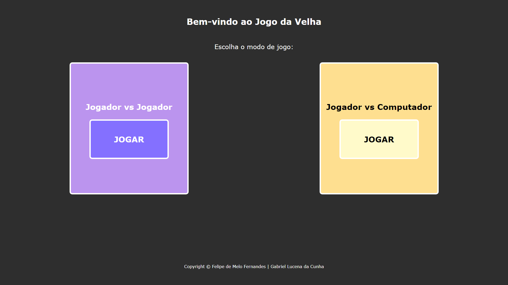
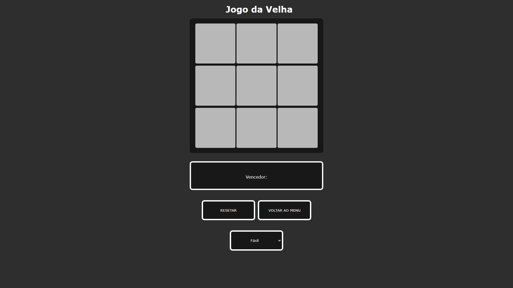

Site criado com o objetivo didático para as aulas de PWFE do curso de Desenvolvimento de Sistemas do SENAI Jandira, sob orientação do professor [Fernando Leonid](https://github.com/fernandoleonid).
O projeto consiste em criar um jogo da velha utilizando HTML, CSS e JavaScript que tenha opções de "Jogador vs Jogador" e "Jogador vs Computador". 

